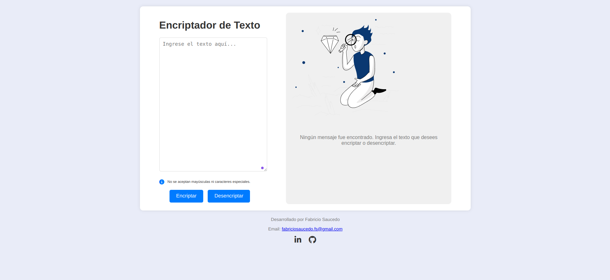
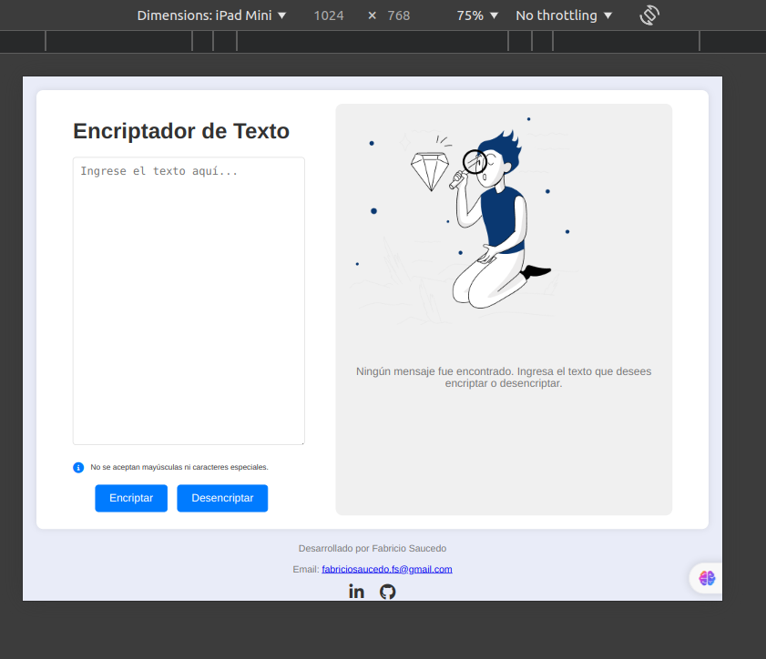
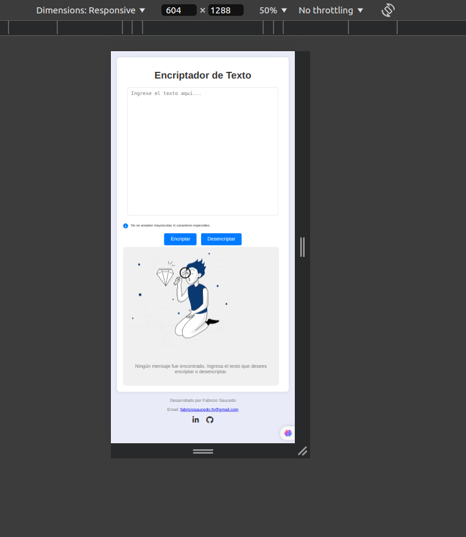

# Encriptador de Texto - Proyecto parte del challenge del Programa ONE - G7 del 2024

## Descripción

Este proyecto es una aplicación web que permite encriptar y desencriptar textos utilizando reglas específicas. Es una herramienta útil para quienes buscan proteger la información de manera sencilla. La aplicación es completamente responsiva y se adapta a dispositivos móviles, tablets y pantallas de escritorio. 

## Funcionalidades

- **Encriptar Texto**: Convierte un texto ingresado utilizando las siguientes reglas:
  - 'e' se convierte en 'enter'
  - 'i' se convierte en 'imes'
  - 'a' se convierte en 'ai'
  - 'o' se convierte en 'ober'
  - 'u' se convierte en 'ufat'

- **Desencriptar Texto**: Reversa el proceso de encriptación devolviendo el texto a su forma original.

- **Copia al Portapapeles**: Permite copiar el texto encriptado o desencriptado al portapapeles con un solo clic.

- **Responsivo**: El diseño se adapta a dispositivos móviles, tablets y pantallas de escritorio.

## Capturas de Pantalla

### Vista de Escritorio


### Vista en Tablet


### Vista en Móvil


## Tecnologías Utilizadas

- **HTML5**: Estructura del contenido.
- **CSS3**: Estilos y diseño responsivo.
- **JavaScript**: Lógica para encriptar/desencriptar texto y gestionar eventos.
- **Font Awesome**: Iconos para la interfaz de usuario.
- **Toastify.js**: Notificaciones estéticas para la interfaz de usuario.

## Instalación y Uso

### Clonar el Repositorio

```bash
git clone https://github.com/FabriSauce/ONE-Encriptador.git
cd encriptador-de-texto
```

### Abrir en el Navegador

Simplemente abre el archivo `index.html` en tu navegador preferido para ver la aplicación en funcionamiento.

### Modificaciones

Puedes modificar los estilos en `styles.css` y la lógica en `script.js` según tus necesidades.

## Contacto

Para más información o consultas:

- **Email:** [fabriciosaucedo.fs@gmail.com](mailto:fabriciosaucedo.fs@gmail.com)
- **LinkedIn:** [LinkedIn](https://www.linkedin.com/in/fabricio-saucedo/)
- **GitHub:** [GitHub](https://github.com/FabriSauce)
